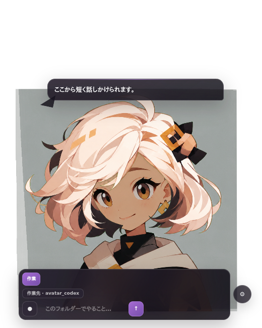

<p align="center">
  
</p>

<h1 align="center">PuruPet Desktop</h1>

<p align="center"><strong>デスクトップに、会話できる相棒を。</strong></p>
<p align="center">透過PNGTuber × ChatGPTログイン × 音声 × Codex作業を、邪魔にならない小さなWindowsアプリへ。</p>

<p align="center">
  
  
  
  
</p>

<p align="center">
  <a href="#クイックスタート">クイックスタート</a> ·
  <a href="#できること">できること</a> ·
  <a href="#一枚絵からキャラクターを追加">Avatar Studio</a> ·
  <a href="./DESKTOP_APP.md">デスクトップ版ガイド</a> ·
  <a href="./docs/usage.md">ブラウザー版ガイド</a>
</p>

<p align="center">
  
</p>

PuruPet Desktopは、[rotejin/PuruPuruPNGTuber](https://github.com/rotejin/PuruPuruPNGTuber)を基にした非公式派生アプリです。アバターが呼吸し、視線を動かし、話し、必要なら選択フォルダー内の作業まで手伝います。入力欄も作業UIも必要なときだけ現れる、デスクトップ常駐前提の設計です。

> [!IMPORTANT]
> このリポジトリは公開準備中です。コードはApache-2.0ですが、画像には別の利用条件があります。公開・フォーク・配布前に[ライセンスと素材](#ライセンスと素材)を確認してください。

## できること

| 会話できるデスクトップコンパニオン | そのままCodex作業 | 自分の一枚絵をPuruPuru化 |
| --- | --- | --- |
| 顔の近くの吹き出しへ返答をストリーミング。入力欄はキャラへマウスを重ねたときだけ表示。 | `会話 / 作業`を小さなUIから切替。現在の操作、完了結果、直近12件の履歴を保持。 | Codex Avatar Studioが目・口・表情差分、髪レイヤー、動き、性格をまとめて生成。 |

### デスクトップに馴染む

- 透明・最前面のフレームレスアバター
- 呼吸、まばたき、髪揺れ、待機視線、3段階リップシンク
- キャラクター上にカーソルがある間だけ有効なマウス追従
- モニター端への吸着、位置ロック、マルチモニター対応
- キャラごとの表示サイズ、可動範囲、追従速度、呼吸・体・髪の揺れ、性格、話し方、吹き出し位置
- OSのライト／ダーク表示とキャラクター色へ適応するニュートラルUI
- 視差・透明効果・高コントラストなどOSのアクセシビリティ設定へ追従

### 会話と音声

- Codex app-serverのChatGPTログイン、またはOpenAI Responses API
- 長文時だけ全文表示と上限付きスクロールを出すコンパクトな吹き出し
- Codex Realtime、ローカルsherpa-onnx、端末音声認識、OpenAI文字起こしを選択可能
- Windows標準音声またはローカルStyle-Bert-VITS2による読み上げと、設定からのON/OFF
- キャラクターをクリックしたときの反応も、選択中の音声で読み上げ
- 応答待ちが0.8秒を超えたときだけ、キャラクターらしい短い音声フィラーを一度再生
- キャラクターごとの触れ合い文、表情、会話メモリ

Style-Bert-VITS2は設定の「デスクトップ → 音声方式」から選択します。ローカルAPIのURL（既定 `http://localhost:5000`）、モデルID、速度だけを指定でき、`/docs`のURLを入力した場合も自動的に`/voice`へ接続します。長い返答はAPIの100文字上限に合わせて分割し、順番に再生します。

音声入力は「デスクトップ → 音声入力」から選択します。`自動`はCodex Realtimeを優先し、利用できなければ端末音声認識へ切り替えます。`sherpa-onnx`はローカルの公式non-streaming WebSocket server（既定 `ws://localhost:6006`）へ、停止するまで録音した音声を送って認識します。

### 安全な作業モード

- 会話モードはread-only
- 作業モードは利用者が選択した1フォルダーだけをworkspace-write
- 作業内容、実行中の操作、完了結果を独立した履歴へ保持
- 実行中ターンを履歴パネルから中断可能
- 技術判断や安全性はキャラクター演出から分離し、進行説明と完了報告だけに性格を反映
- Codex作業ではライブWeb検索を有効化

### 画面とブラウザーを、会話の中で許可

「今の画面を見て」や「このサイトを調べて」と話すと、キャラクターがその場で許可を尋ねます。

- 画面共有は、その瞬間にカーソルがあるモニターを1枚だけ取得
- ブラウザーはログインを引き継がない可視の専用ウィンドウ
- 許可は1回答・1ホストだけ。次の会話へ持ち越さない
- ブラウザー操作はページ閲覧、本文取得、リンク移動、戻るだけ
- 文字入力、フォーム送信、ダウンロード、購入、認証変更は行わない
- 一時スクリーンショットは回答後に削除

## 収録キャラクター

デスクトップ配布物には新規4キャラクターだけを収録します。

| 琥珀 | セピア | ルナ | セージ |
|:---:|:---:|:---:|:---:|
|  |  |  |  |
| 快活で素直。前向きに背中を押す。 | 余裕と洞察があり、頼れる。 | 静かで丁寧。集中を大切にする。 | 穏やかな知性派。複雑なことを整理する。 |

各キャラクターは通常の目・口差分に加え、嬉しい・驚き・やさしい表情差分を持ちます。選択キャラに合わせて設定画面とコンパニオンUIのアクセントも変化します。

## クイックスタート

### 必要環境

- Windows 10/11 x64
- Node.js 22以降
- Codex機能を使う場合は、ログイン可能な[Codex CLI](https://github.com/openai/codex)
- Python検査を行う場合のみPython 3.11と[uv](https://docs.astral.sh/uv/)

### 開発版を起動

```bash
npm ci
npm run desktop
```

初回起動ウィザードで、ChatGPTログインまたはOpenAI API、キャラクター、音声出力を設定します。Windows Store版Codexも自動検出します。`codex`が`PATH`にない場合は`CODEX_CLI_PATH`で実行ファイルを指定できます。

### キャラクターから会話・作業

1. キャラクター右下の`✦`へマウスを重ねます。
2. 小さな入力欄から会話します。
3. 左端の`会話`を押すと`作業`へ切り替わります。
4. 初回だけWindowsのフォルダー選択で作業先を指定します。
5. `履歴`から直近の指示・操作・結果を再表示できます。

主なショートカット:

| 操作 | キー |
| --- | --- |
| 現在のモードの入力欄を開く | `Ctrl + Shift + Enter` |
| 設定を開く | `Ctrl + Shift + M` |
| クリック透過 | `Ctrl + Shift + L` |
| キャラクター表示 | `Ctrl + Shift + H` |

## AI接続とプライバシー

### Codex app-server

アプリはローカルの`codex app-server --stdio`を起動します。ChatGPTの認証トークンはCodexが管理し、PuruPetは受け取りません。会話と作業は別スレッド・別権限で、設定画面からそれぞれのモデルと推論の深さを変更できます。推論の深さは固定の秒数ではなく、モデルへ渡すreasoning effortです。

Codex Realtimeは実験機能です。ChatGPT側で利用できず404になる場合は、その起動中の再試行を止め、利用可能な端末音声認識へ切り替えます。`realtime_conversation`とapp-serverの`experimentalApi`はアプリ側で有効化済みです。

### OpenAI API

Responses APIによる会話とTranscriptions APIによる文字起こしを利用できます。APIキーはレンダラーへ渡さず、利用可能な場合はOSの暗号化ストレージへ保存します。

### マイクと読み上げ

通常の口パクは音量値だけをローカル処理します。sherpa-onnxと端末音声認識はローカルで処理します。Codex RealtimeやOpenAI文字起こしを使う場合は、音声が該当サービスへ送られます。現在の入力方式はUIに表示されます。

## 一枚絵からキャラクターを追加

Codex app-server接続時は、設定の`Codex Avatar Studio`からPNG・JPEG・WebPを選べます。同梱の[`.agents/skills/build-purupuru-avatar/`](./.agents/skills/build-purupuru-avatar/)を隔離されたworkspace-writeジョブで実行し、次を生成・検証してから追加します。

- 目2段階 × 口3段階の標準PNG差分
- 嬉しい・驚き・やさしい表情差分
- 前髪・後ろ髪レイヤー
- 初期リグ、表示サイズ、可動範囲
- 性格、話し方、触れ合い文

利用者は、アップロード・加工・利用に必要な権利を持つ画像だけを使用してください。

## WindowsバイナリとGitHub Actions

ローカルでNSISインストーラーとportable版を生成します。

```bash
npm run dist:win:installer
```

[`Windows package`](./.github/workflows/release.yml)はWindowsランナーで同じビルドを行います。

- Actions画面から手動実行すると、14日間保持される成果物を作成
- `v0.1.0`のようなタグをpushすると、`.exe` 2種と`SHA256SUMS.txt`をDraft Releaseへ添付
- 署名設定がない現在はDraftに留め、実機確認後に公開可能
- ActionsはすべてコミットSHAで固定し、Dependabotで更新

現在の開発ビルドはコード署名されていません。一般配布前に署名とSmartScreen確認を推奨します。

## GitHub Pages

[`site/`](./site/)に機能紹介ランディングページを収録しています。ローカル生成:

```bash
npm run site:build
```

生成先は`site-dist/`です。[`GitHub Pages`](./.github/workflows/pages.yml)が`main`更新時に静的成果物を組み立てて公開します。リポジトリの **Settings → Pages → Source** を **GitHub Actions** に設定してください。キャラクター画像は既存素材からビルド時だけコピーし、ソース内では二重保持しません。

## ブラウザー版PuruPuruエディター

元のPuruPuru編集画面とOBS向け透過表示も残しています。

```bash
uv run python scripts/run_local_server.py
```

表示された`http://127.0.0.1:8223/`をChromeまたはChromiumで開きます。素材形式、OBS、調整方法は[docs/usage.md](./docs/usage.md)を参照してください。

調整したキャラクターは、画像込みのポータブルな `.purupuru` アバターパッケージとして保存できます。元のPNG素材フォルダに依存しないため、バックアップや別PCへの移行に利用できます。

## 開発とテスト

```bash
npm test
npm run site:build
```

| パス | 内容 |
| --- | --- |
| `desktop/` | Electronメインプロセス、preload、設定・会話UI |
| `assets/` | キャラクター画像とPuruPuru設定 |
| `.agents/skills/` | 一枚絵からキャラクターを追加するCodex Skill |
| `site/` | GitHub Pages用ランディングページ |
| `vendor/mediapipe/` | オフライン顔追従に必要なMediaPipe、WASM、モデル |
| `scripts/` | ローカルサーバー、サイト生成、検証補助 |
| `tests/` | Node / JavaScript / Pythonテスト |

`vendor/`に残すのは、`npm install`では復元できず、カメラ顔追従をオフラインで動かすMediaPipeランタイムとモデルだけです。日本語Webフォントは数百の分割ファイルになるため同梱せず、OS標準フォントを使います。更新方法は[docs/vendor-update.md](./docs/vendor-update.md)を参照してください。

## ライセンスと素材

- ソフトウェアコードとドキュメント: [Apache License 2.0](./LICENSE)
- 元プロジェクトと変更点: [NOTICE](./NOTICE)、[MODIFICATIONS.md](./MODIFICATIONS.md)
- 第三者依存関係: [THIRD_PARTY_NOTICES.md](./THIRD_PARTY_NOTICES.md)
- デスクトップ版の新規4キャラクター: [DISTRIBUTION_ASSET_LICENSE.md](./DISTRIBUTION_ASSET_LICENSE.md)
- 元ブラウザー版に残る上流サンプル素材: [ASSET_LICENSE.md](./ASSET_LICENSE.md)

デスクトップ配布物には上流の旧デモキャラクターと旧faviconを含めません。ソースツリーに残る上流サンプルは、ブラウザー編集画面の互換性・検証用であり、Apache-2.0の対象ではありません。

> [!WARNING]
> 新規4キャラクターの元絵と生成差分を複製・加工・公開配布できることを、公開前に権利者が確認してください。ライセンス文書を置くだけでは元画像の権利は発生しません。

## コントリビューション

- [Contributing](./.github/CONTRIBUTING.md)
- [Security policy](./.github/SECURITY.md)
- [Support](./.github/SUPPORT.md)
- [GitHub公開チェックリスト](./docs/github-release-checklist.md)

PuruPet Desktop is not endorsed by or affiliated with the original PuruPuru PNGTuber developer.
